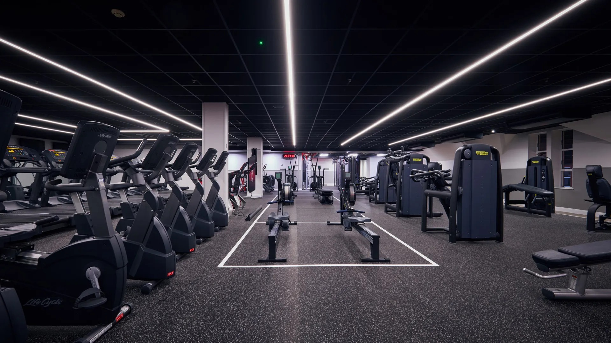
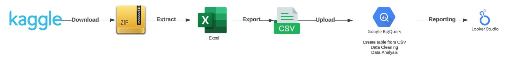

    <h1>Data-Science-Portofolio</h1>

 
 

     <h1>Gym Performance Insights</h1>
      

 

<h2>Executive Summary, Documentation, Project Report, Impact Evaluation</h2>  
 
 

Reaching fitness goals isn’t just about showing up at the gym. It’s about understanding what workouts and routines are best for each individual. People are unique, and what might work best for one could not work or even harm another. To help gym members improve their performance, it’s important to identify patterns in workout habits and understand how different factors like gender, age, or BMI influence the results. 

 

This project aims to provide insights into fitness recommendations using a structured dataset exported from Kaggle, containing 973 records with variables such as age, weight, gender, session duration, and calories burned. BigQuery (BQ) is used for storage, cleaning, deduplication, and analysis. Although the dataset is small now, it can dramatically increase over time. The built-in SQL functions help identify any NULL values and duplicates easily or format data for consistency.  Once prepared, BQ ML built-in machine-learning models are used for advanced analysis.

 

Looker Studio (LS) is chosen for reporting LS as enables users with minimal technical skills to explore and interpret the data which makes it a great choice for visualizing the data. The tool is free to use to create and share a dashboard. The main costs are related to storage in BQ and querying the data.

 

By combining the robust data handling of BigQuery with Looker Studio’s user-friendly dashboards, this project helps people get personalised insights that guide them toward achieving their fitness goals. This solution is designed to grow with the dataset, making sure insights stay clear and useful.

 
 

<h2>Data Infrastructure & Tools</h2> 
 
 Figure A: Data Architecture</h4>

 

The fact that BQ allows the use of standard SQL for data cleaning and transformations, which is a language widely understood, eliminates the need to know specialised coding and allows data engineers and analysts to work collaboratively. BigQuery ML also offers built-in machine learning models (e.g., model_type='linear_reg', model_type='logistic_reg'), which allow for advanced analysis that produces insights tailored to individual fitness outcomes.

 
 
For reporting, Looker Studio is the perfect choice as it can connect to BQ directly, which ensures up-to-date insights into the data (Google.com, 2019). There is no need to purchase licenses as the tool is free to use to create dashboards and share them with the stakeholders. This makes it a highly cost-effective and preferred choice.

 

The dataset doesn’t store sensitive data, such as personal identification or names, but access is still provided based on role, this being enforced in BQ, access being a query-only one. This is to prevent any unwanted changes and keep data integrity.

 

BigQuery and Looker Studio offer an efficient, cost-effective and scalable solution for data storage, analysis, and reporting. This ensures the project can grow and adapt as the dataset evolves.

 

<h2>Data Engineering</h2>  
 
 

This step is critical because the quality of data directly impacts the accuracy of insights and decisions. The saying “garbage in, garbage out” highlights that if poor-quality data is analysed, the results will be misleading. Ensuring clean, accurate data is analysed leads to informed decisions.

 

This project follows an ELT (Extract, Load, Transform) approach, using BigQuery for both data storage and transformations.
 
<h3>Extract:</h3>  

The dataset has been downloaded from Kaggle as a ZIP file. Within the archive, an Excel file containing the gym metrics and dimensions was identified. Since BQ does not directly support Excel, the file was converted to CSV format to create a table in BQ.

<h3>Load:</h3>  

The data is then uploaded into BQ by using its functionality to create tables directly from CSV files (Figure B). Once uploaded, the data is now visible in BQ in its original form, and ready for further cleaning and analysis (Figure C). 

