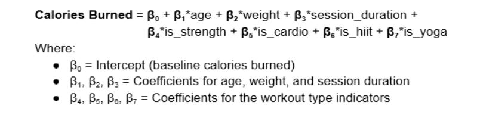

    <h1>Data-Science-Portofolio</h1>

 
 

     <h1>Gym Performance Insights</h1>
      

 

<h2>Executive Summary, Documentation, Project Report, Impact Evaluation</h2>  
 
 

Reaching fitness goals isn’t just about showing up at the gym. It’s about understanding what workouts and routines are best for each individual. People are unique, and what might work best for one could not work or even harm another. To help gym members improve their performance, it’s important to identify patterns in workout habits and understand how different factors like gender, age, or BMI influence the results. 

 

This project aims to provide insights into fitness recommendations using a structured dataset exported from Kaggle, containing 973 records with variables such as age, weight, gender, session duration, and calories burned. BigQuery (BQ) is used for storage, cleaning, deduplication, and analysis. Although the dataset is small now, it can dramatically increase over time. The built-in SQL functions help identify any NULL values and duplicates easily or format data for consistency.  Once prepared, BQ ML built-in machine-learning models are used for advanced analysis.

 

Looker Studio (LS) is chosen for reporting LS as enables users with minimal technical skills to explore and interpret the data which makes it a great choice for visualizing the data. The tool is free to use to create and share a dashboard. The main costs are related to storage in BQ and querying the data.

 

By combining the robust data handling of BigQuery with Looker Studio’s user-friendly dashboards, this project helps people get personalised insights that guide them toward achieving their fitness goals. This solution is designed to grow with the dataset, making sure insights stay clear and useful.

 
 

<h2>Data Infrastructure & Tools</h2> 
 
 

In this project, the flow of data is streamlined and it involves a small number of tools used to achieve the desired results (Figure A). The dataset used is a public source which was downloaded from Kaggle and it has 973 records which contain data about individuals' gender,  weight, age, calories burned, and session duration. This file is used as a source for creating a table in BigQuery (BQ). BQ is the main platform used for tabular data storage, cleaning, and analysis. It can process large datasets efficiently and cost-effectively, with active storage at $0.02 per GB per month and querying at $6.25 per TiB. Its powerful SQL functions make it easy to prepare the data, helping to spot NULL values  (e.g., IS NULL, IF NULL) and duplicates at scale (e.g., DISTINCT, ROW_NUMBER), ensuring consistency as the dataset grows.

    <h4>Figure A: Data Architecture</h4>

 

The fact that BQ allows the use of standard SQL for data cleaning and transformations, which is a language widely understood, eliminates the need to know specialised coding and allows data engineers and analysts to work collaboratively. BigQuery ML also offers built-in machine learning models (e.g., model_type='linear_reg', model_type='logistic_reg'), which allow for advanced analysis that produces insights tailored to individual fitness outcomes.

 
 
For reporting, Looker Studio is the perfect choice as it can connect to BQ directly, which ensures up-to-date insights into the data (Google.com, 2019). There is no need to purchase licenses as the tool is free to use to create dashboards and share them with the stakeholders. This makes it a highly cost-effective and preferred choice.

 

The dataset doesn’t store sensitive data, such as personal identification or names, but access is still provided based on role, this being enforced in BQ, access being a query-only one. This is to prevent any unwanted changes and keep data integrity.

 

BigQuery and Looker Studio offer an efficient, cost-effective and scalable solution for data storage, analysis, and reporting. This ensures the project can grow and adapt as the dataset evolves.

  

<h2>Data Engineering</h2>  
 
 

This step is critical because the quality of data directly impacts the accuracy of insights and decisions. The saying “garbage in, garbage out” highlights that if poor-quality data is analysed, the results will be misleading. Ensuring clean, accurate data is analysed leads to informed decisions.

 

This project follows an ELT (Extract, Load, Transform) approach, using BigQuery for both data storage and transformations.
 
<h3>Extract:</h3>  

The dataset has been downloaded from Kaggle as a ZIP file. Within the archive, an Excel file containing the gym metrics and dimensions was identified. Since BQ does not directly support Excel, the file was converted to CSV format to create a table in BQ.

<h3>Load:</h3>  

The data is then uploaded into BQ by using its functionality to create tables directly from CSV files. Once uploaded, the data is now visible in BQ in its original form, and ready for further cleaning and analysis.  

<h3>Transform:</h3> 

Once the data is loaded into BQ, it undergoes key transformations for quality and consistency, and a new table is created from the raw data. First, NULL values are handled, with the Gender field being replaced by "Other" where necessary. Invalid values, such as negative entries in the Weight__kg_ field, are converted to NULL. This method is preferred in this case because replacing it with a median could introduce bias as the dataset is relatively small, ensuring that only valid values are analysed in this way.

Duplicates are removed using SELECT DISTINCT, ensuring each record is unique. All fields are renamed to keep consistency across naming conventions and descriptions have been added to each of them for a better understanding of what each field represents. A new numeric field is created based on the workout_type dimension to use in the analysis. Additionally, data is validated and normalised, such as ensuring Height__m_ and Calories_Burned follow expected units and ranges.

 

Finally, the transformed data is checked to ensure it is now clean and ready for analysis. It has been observed that the same number of records remained after including only records that have age>0 and session_duration_hours>0, which indicates a qualitative dataset.

  

<h2>Data Analytics</h2>  
 
 

 As people age, staying in shape becomes more challenging, but making a plan to burn the needed calories to stay in shape, can make the whole process easier. The goal here is to understand how various factors influence calorie burn and overall performance, which will help with creating a personal fitness plan.
 

 
	To identify patterns, understand the dataset better, and detect potential issues or biases, an exploratory data analysis (EDA) was conducted. Although the data shows a balance across genders and workout types, there is an underrepresentation of level 3 participants, which could influence the results.

 

Statistical measures like MIN, MAX, MEAN, and standard deviation, applied to numerical fields such as age, and calories burned, help summarise the data. The participants work out on average 3.18 days a week, burning about 905 calories per session, through different intensities of workouts. Weight ranges between 40 kg and 129,9 kg, showing diverse body types. Overall, the data reflects a wide range of fitness levels and habits.

After EDA, linear regression analysis (Google Cloud, n.d.) was chosen to identify the relationships between different factors. Initially, a linear regression model was created using only age, workout type, and calories burned. However, the results were significantly off, with an R2  score of only 2.32%, indicating that the model does not accurately predict the calories burned (Figure N). The issue was how workout_type_code was defined because the model treated the values as ordinal or numeric. This was fixed by using one-hot encoding to represent each workout type as separate categories, ensuring the model treated them correctly.
 

To improve the model’s accuracy even more, additional factors, such as session duration ( which makes sense because longer workouts mean prolonged effort and, as a consequence, calories burned) and weight ( which makes sense because it is directly linked to calories burned) were included. The linear regression model was recreated with the new variables and 
the results have considerably improved with an R2  score of 85.40%, indicating that the model is very good at predicting based on the added variables.

 

With confirmation that the model performs well and based on the calculation for the calories burned (Figure B), the relationship coefficients can be analysed to understand how each factor influences the calories burned. Now that the model can predict the number of calories burned and is based on the relationship coefficients,  it is easy to estimate, for example, the session duration based on the target calorie burn.

    <h4>Figure B:  Calories Burned Calculation based on the Linear Regression Model</h4>

  

<h2>Data Visualisation & Dashboards</h2>  
 
 

 A variety of charts for visualising the model's accuracy and for further analysis have been created in Looker Studio to make it easy to understand the data and extract valuable insights. Visualisations like age distribution (Figure C) and member distribution by workout type and gender (Figure D) help uncover key insights about gym members and their preferences. The predicted vs actual calories burned (Figure E) chart, compares the model’s predictions compared to the actual data. This helps to assess how well the model performs. 

 

 Each visualisation is designed to be clear and simple to understand, ensuring that even the users with minimal technical knowledge can interpret the data easily. Additionally, interactive filters have been added, allowing users to customise views and explore specific insights based on different variables such as the workout type. These filters offer a more user-tailored experience, allowing them to deep dive into the data according to their needs.

 

 As a potential future improvement, the dashboard could allow users to input/choose specific values and use the model as a calculator, enabling what-if scenarios. This feature would take the report to the next level and make it a dynamic decision-support system.

